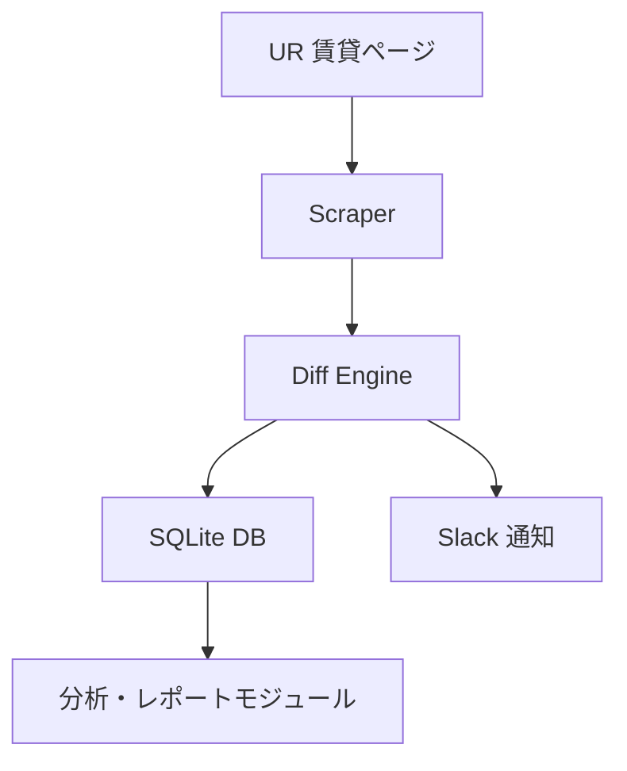

# AGENT: URWatcher

## 概要
URWatcher は、UR都市機構（https://www.ur-net.go.jp/）の賃貸物件ページを定期的にクロールし、
新規物件の追加・削除を自動検出して通知する監視エージェントです。

主な目的は以下の通りです。

- 希望物件に空きが出た瞬間を検知する
- 特定マンションの空室発生・埋まりやすさを統計的に把握する
- URサイトの更新傾向を把握し、入居チャンスを逃さない

---

## 機能一覧
| 機能 | 内容 |
|------|------|
| ページ監視 | UR賃貸一覧ページをクロールし、掲載物件リストを取得 |
| 差分検出 | 新規追加・削除・更新を前回結果と比較して判定 |
| 通知機能 | Slack WebhookまたはLINE Notifyへの通知送信 |
| データ保持 | SQLite（またはPostgreSQL）で履歴を永続化 |
| 統計解析 | 空室発生率・平均滞留日数・再空室周期を算出 |

---

## システム構成



---

## デプロイ戦略
- 当面は macOS 上で Docker コンテナを起動し、`./data/urwatcher.db` をボリュームとしてマウントするローカル実行を基盤に開発・検証を継続
- ローカル運用が安定した後に GitHub Actions と AWS（ECS/Fargate など）を用いたリモートデプロイを再検討し、必要に応じて IaC や Secrets 管理を導入する方針

---

## 技術スタック
- Python 3.11+
- requests, BeautifulSoup4
- sqlite3
- Slack Webhook API
- （オプション）Playwright for JSレンダリング
- （オプション）Docker, GitHub Actions, Cloud Run

---

## ローカル開発フロー
- `Dockerfile.dev` を利用して `python:3.11-slim` ベースの開発用コンテナをビルドし、`docker compose` で `./data` ディレクトリを `/app/data` にマウント
- `DATABASE_URL=sqlite:///data/urwatcher.db` を環境変数で指定し、SQLite ファイル（`./data/urwatcher.db`）をホスト側に永続化
- コードは `.:/app` をマウントしてホットリロード、`docker compose run urwatcher --init` で初期化、`--run` で監視実行、`pytest` でテストを実施
- Slack Webhook や API キーは `.env` または `docker compose` の環境変数に設定し、実サービスへの通知が不要な場合はダミー URL を利用

---

## エージェント動作ポリシー
| 項目 | 内容 |
|------|------|
| 実行頻度 | デフォルト: 1時間ごと（設定可能） |
| 負荷対策 | robots.txtを遵守し、アクセスは間隔を空けて実行 |
| エラー時挙動 | リトライ最大3回、指数バックオフ付き |
| データ保持期間 | イベント履歴90日（可変） |

---

## 拡張予定
- Playwright対応（JSレンダリング後のDOM取得）
- BigQuery連携による分析ダッシュボード
- 通知チャネル追加（LINE Notify, Discord, Telegram）
- Web UI（StreamlitまたはReact）による可視化

---

## 管理者操作例
```bash
python monitor_ur.py --init
python monitor_ur.py --run
```

---

## 開発者
- Project Lead: Yoshihiko Miyaichi
- Maintainer: ChatGPT (GPT-5) Co-pilot
- License: MIT

---

## 倫理・法務に関する注意
- UR賃貸公式サイトの robots.txt に従い、適正なリクエスト間隔で運用すること。
- 商用転用は禁止。
- 公共目的（研究・統計・居住支援等）のみ許容。
